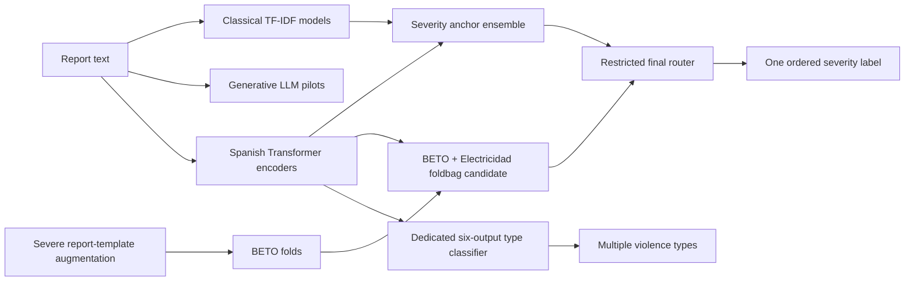

# WomenHelp 2026: violence report classification

Classical baselines, Spanish Transformer encoders, targeted Severe augmentation and a conservative final severity router.

**Research source release.** This repository documents the implementation and aggregate results of the WomenHelp system by Marcel Herrera Rendón, Universidad de Sonora. It is not an operational assessment service. It does not distribute report narratives, document identifiers, predictions for individual cases, trained checkpoints or private experiment logs.

[Español](README.es.md) · [Results and evidence](docs/results.md) · [Method](docs/method.md) · [Reproduction](docs/reproduction.md) · [Presentation materials](presentation/README.md)

## Approach



We explored generative prompting and LoRA, classical word/character TF-IDF, and contextual encoders including BETO, Electricidad and BERTin. Generative LLMs also use Transformers: these are three modeling approaches, not three disjoint architecture categories.

The six violence types are Economic, Physical, Property-related (officially Patrimonial), Psychological, Sexual and Vicarious. Final S2 derives N/A when none of its six sigmoid scores reaches 0.45. S1 predicts Mild, Medium, High or Severe.

## Key results

| Evaluation | Measure | Result |
|---|---|---:|
| Official test, final severity | Macro-F1 | 0.60798 (3rd / 16) |
| Official test, final violence types | Micro-F1 | 0.87016 (6th / 15) |
| Development, Severe augmentation | Macro-F1 | 0.548114 → 0.555198 |
| Development, Severe augmentation | Severe F1 | 0.417808 → 0.433460 |
| Development, Severe augmentation | Severe recall | 0.396104 → 0.370130 |

Adding 516 template-generated Severe texts raised its training share from 4.52% to 8.00%. This partly reduced imbalance. F1 improved while recall fell. Template style, class balance and class weights changed together, so this comparison does not isolate their causal effects.

The final router changed 290 / 4,219 severity predictions, retaining 93.13% of the anchor output. It allowed only Medium→Mild, Mild→Medium and High→Severe; the last transition additionally required lexical severe-evidence cues. Official test scores informed selection. Transfer across institutions remains untested.

## Quick start without private data

Python 3.11 or newer is required. From the repository root:

```bash
python -m pip install -e .
python -m unittest discover -s tests -v
python scripts/demo_public.py
```

The demo uses artificial placeholders created solely for software checks. It prints aggregate counts, never real reports. No model download or GPU is required.

For classical experiments install `python -m pip install -e ".[classical]"`; for encoder experiments install `python -m pip install -e ".[encoders]"`. Install a PyTorch build appropriate for your hardware. These extras are dependency declarations, **not a recovered lockfile for the original GPU environment**. See the [reproduction boundary](docs/reproduction.md).

## Repository map

- `src/womenhelp_competition/`: data readers, labels, parsing, metrics and augmentation.
- `scripts/`: curated original training, inference, ensemble and routing entry points, plus a public demo.
- `results/`: aggregate evidence with explicit evaluation protocols.
- `docs/`: methods, limitations, data access and reproduction instructions.
- `presentation/`: bilingual poster, slides and speaker scripts.
- `tests/`: checks that require no original narratives.

Acquire competition data directly from the [WomenHelp organizers on Codabench](https://www.codabench.org/competitions/14614/) under their applicable terms. A public code repository does not grant rights to redistribute the corpus or pretrained models.

## Citation and release scope

See [CITATION.cff](CITATION.cff). The associated system-description paper is *marcelhr at WomenHelp 2026: Conservative Ensembles and Ordinal Routing for Gender-Based Violence Classification*. No unverified DOI or publication URL is supplied.

This curated release preserves the scientific code with portable default paths and standard TLS verification. It omits the private development history. Exact leaderboard reproduction needs the original checkpoints, probability sources and unreleased test labels or organizer scoring; those are not included. New annotation-consensus analysis is explicitly dated after the paper submission.

No software license has yet been selected by the author. Public availability alone does not grant a general reuse license. Please request permission through GitHub until this is resolved.
